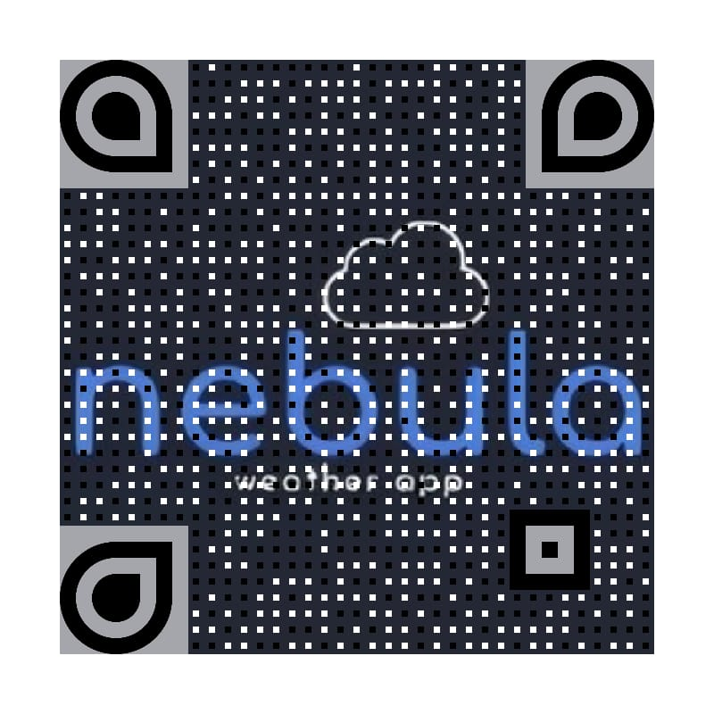

# 2021_Nebula

# :cloud_with_lightning_and_rain: 	Opis
Nebula, weather app je aplikacija namenjena android uređajima. Aplikacija je namenjena svakodnevnoj upotrebi i pruža nam informacije o trenutnoj temperaturi vazduha, koeficijentu zagađenosti vazduha i kvalitetu istog, pružajući nam informacije o detaljnom sastavu vazduha, kao i još mnogo značajnih informacija za preko 200 000 gradova.

# :computer: Jezici i tehnologije
Korišćen je programski jezik Dart i framework Flutter u Android Studio okruženju.

# :calling: Pokretanje
Aplikacija je podržana za Android. Da bi se pokrenula na računaru potrebno je imati Android Studio, Dart i Flutter sdk. Za instaliranje aplikacije na mobilnom uređaju dovoljno je skenirati QR kod ili preuzeti nebula.apk fajl iz https://github.com/matf-pp/2021_Nebula/releases, a nakon toga preko mobilnog uređaja pokretati kao i sve ostale aplikacije. 

# :mailbox_with_mail: Autori
Lucija Miličić 29/2018 lucija.milicic99@gmail.com

Natalija Asanović 171/2018 asanovic.natalija@gmail.com

Jovana Đurović 290/2018 jovana.djurovich@gmail.com
